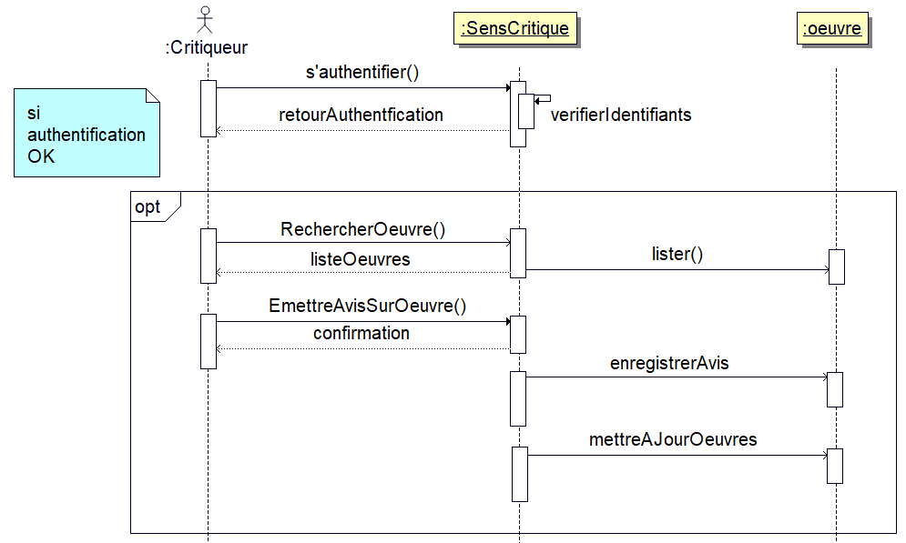

## UML : Compte-rendu

Ce site contient le carnet de bords des différentes séances d'UML

### Séance 1 
[ ](https://chouette3000.github.io/ProjetUML/Seance1/)

### Séance 2
[ ](https://chouette3000.github.io/ProjetUML/Seance2/)

### Séance 3
[ ](https://chouette3000.github.io/ProjetUML/Seance3/)

### Séance 4
[ ](https://chouette3000.github.io/ProjetUML/Seance4/)
	
### Auteurs du site : 

- _Camélia Zarzitski Benhmida_ 
- _Alex Zarzitski_
