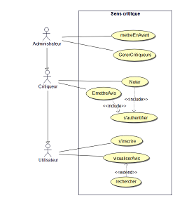
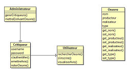
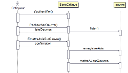

## UML : Compte-rendu

Ce site contient le carnet de bords des différentes séances d'UML

Le dossier git associé contient la modélisation UML produite au cours des différentes séances (réalisée avec le logiciel "Bouml")

### Séance 1 

### Séance 2

### Séance 3

### Séance 4

	
### Auteurs du site : 

- _Camélia Zarzitski Benhmida_ 
- _Alex Zarzitski_
