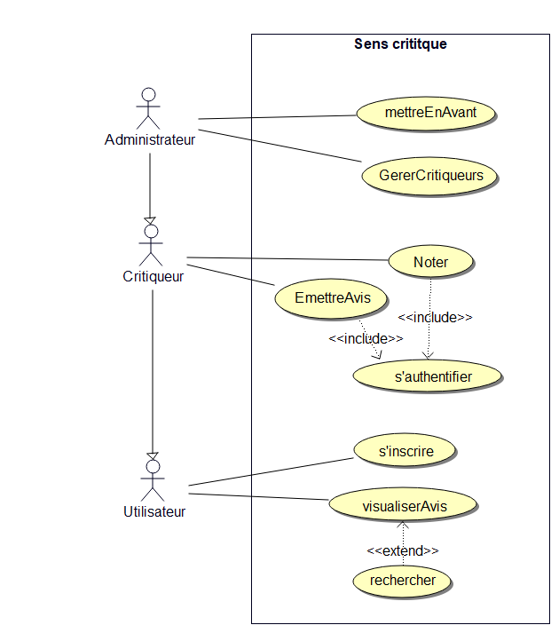

# UML SEANCE 2 : Diagramme de cas d'utilisation

<h2>Qu'est ce qu'un diagramme de cas d'utilisation ?</h2>

Le diagramme de cas d’utilisation permet de déterminer les services rendus par le système aux utilisateurs.

Il définit les différents acteurs et leurs interactions avec le système. Les acteurs externes sont également définis.

Les acteurs peuvent être des personnes physiques mais également ou d’autres systèmes ou ressources.

<h2>Description du cas d'utilisation</h2>

Un cas d’utilisation correspond à un service rendu par le système

Il est important de faire la description du cas d'utilisation pour l'analyse et la réalisation d'autres diagrammes (diagramme de séquence etc.)

La description explique les différentes étapes que contient le cas d'utilisation

Pour chaque cas d’utilisation, il y a plusieurs scénarii possibles : 

<ul>
<li>Scénario nominal : Déroulement normal</li>
<li>Scénarios alternatifs : Déroulement différent du scénario nominal</li>
<li>Scénario d'exception : Déroulement lorsqu'une erreur se produit</li>
</ul>

<h2>Sens Critique</h2>

Plusieurs énoncés ont été proposé et l'énoncé "Sens critique" a été choisi

Ce système permet à des utilisateurs de pouvoir noter et émettre une critique sur des films et séries

<h2>Réponses aux question relatives à l'énoncé</h2>
<h3>Quels sont les acteurs ?</h3>

Administrateur, Critiqueur et utilisateur

<h3>Quelles sont les relations entre les acteurs ?</h3>

Il y a plusieurs relations d'héritage : "Critiqueur" hérite d’ "utilisateur", et "administrateur" hérite de "critiqueur".

<h3>Quels sont les cas d'utilisation ?</h3>

Voir le diagramme correspondant (plus bas)

<h3>Que peut faire un administrateur</h3>

Il peut faire la même chose qu'un critiqueur (et qu'un utilisateur, par héritage) et peut également gérer les critiqueurs et mettre en avant des oeuvres

<h3>Quels acteurs interviennent dans ces différents cas d'utilisation ?</h3>

Sur le diagramme, les acteurs intervenant dans un cas d'utilisation sont reliés à celui-ci par une flèche, (voir diagramme plus bas)

<h3>Que visualise le cadre autour des cas d'utilisation?</h3>

Ce cadre représente le système

<h3>Qu'exprime les cardinalités?</h3>

Elles expriment le nombre minimal et maximal d'instance dans une classe

<h3>A quoi sert un diagramme de cas d'utilisation ?</h3>

Il sert à représenté les services rendus par le systèmes aux différents acteurs

<h2>Diagramme de cas d'utilisation</h2>

Pour réaliser ce diagramme, nous avons analyser le texte afin de reconnaître les acteurs (qui interagit avec le système ou lui apporte quelque chose).
une fois les acteurs trouvés, l'analyse a permis d'extraire les cas d'utilisation

à partir de cet énoncé, voici donc le diagramme de cas d'utilisation réalisé : 

<h2>Conclusion de la séance : </h2>

Cette séance a permis de revoir les diagrammes de cas d'utilisation en théorie et en pratique sur 2 énoncés car nous avons débuté avec l'énoncé
donné en exemple <a href="https://mbf-iut.i3s.unice.fr/doku.php?id=2016_2017:s2:td:td_use_cases">ici</a> avant de réaliser celui de sens critique

Il faut faire attention au sens des flèches "include" et "extend" car il aisé de les confondre
