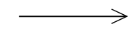
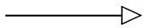
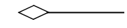
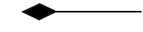
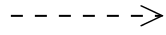
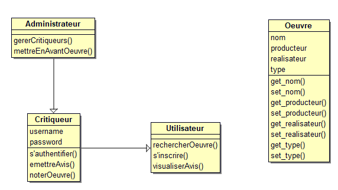

# UML SEANCE 3 : Diagramme de classes

## À quoi sert le Diagramme de classes ?

Le diagramme de classe représente le comportement d’une classe et les relations entre les classes

une classe est un modèle qui permet de fabriquer des objets partageant les mêmes états (attributs) et comportements (méthodes)

Ce diagramme est utile pour les design pattern et pour cette raison, il est beaucoup utilisée en ingénierie logicielle orientée objet

<h2>Comment passer du diagramme de cas d’utilisation au diagramme de classe ? </h2>

On part du diagramme de cas d'utilisation. En effet, pour pouvoir réaliser le diagramme de classe, il faut analyser la description du cas
d’utilisation, c'est ce texte qui permettra de trouver les classes à faire apparaitre sur le diagramme. Ainsi, un verbe correspondra souvent à une
méthode, un chiffre ou une valeur sera souvent un attribut. (Tandis qu'une logique ou un acteur sera une classe.)
<h2> Notation UML pour les classes</h2>

En UML, une classe comprend 3 parties : 

<ul>
<li>le nom de la classe</li>
<li>les attributs</li>
<li>les méthodes</li>
</ul>

<h2>Visibilités</h2>

les méthodes et attributs peuvent avoir différents niveaux d'accessibilité (appelés visibilités) : 

<table>
<tr>
<td>+</td>
<td>public : accessible de partout</td>
</tr>
<tr>
<td>#</td>
<td>protected : accessible uniquement depuis la classe contenante ou les classes filles</td>
</tr>
<tr>
<td>-</td>
<td>private : accessible uniquement par la classe contenante</td>
</tr>

</table>

Par défaut, en Kotlin, tout est public (pas nécessaire de le préciser) 

<h2>Relations entre les classes</h2>

Les classes peuvent avoir plusieurs types de relations, notamment

<table>
<tr>
<td>l'Association</td>
<td></td>
</tr>
<tr>
<td>l'Héritage (Généralisation et Spécialisation)</td>
<td></td>
</tr>
<tr>
<td>l'Agrégation</td>
<td></td>
</tr>
<tr>
<td>la Composition </td>
<td></td>
</tr>
<tr>
<td>la Dépendance</td>
<td></td>
</tr>
</table>

Les relations peuvent être unidrectionnelle ou birectionnelle mais, il est préférable de se limiter à un seul sens (relation unidirectionnelle)

<h2>Diagramme de classe du domaine (énoncé Sens Critique)</h2>

