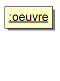
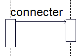
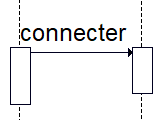
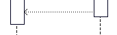
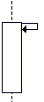
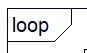
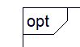

# UML SEANCE 3 : Diagramme de séquence

## Qu'est ce le Diagramme de séquence ?

Ce diagramme permet de décrire les interactions entre les acteurs et le système

L'intérêt principal de ce diagramme est qu'il montre le déroulement chronologique d'un scénario (contrairement au diagramme d'activité)

<h2>Lien avec le diagramme de cas d'utilisation</h2>

Tandis que le diagramme de cas d'utilisation présente une vue externe du système, le diagramme de 
séquence expose les interactions entre les objets afin de réaliser un cas d'utilisation.
Un diagramme de séquence est donc également réalisé à partir de la description d'un cas d'utilisation.

<h2>Principaux éléments du diagramme de séquence</h2>
<table>
<tr>
<td>La ligne de vie représentant la chronologie</td>
<td></td>
</tr>
<tr>
<td>Message asynchrone (qui n'attend pas de retour)</td>
<td></td>
</tr>
<tr>
<td>Message synchrone (qui attend un retour)</td>
<td></td>
</tr>
<tr>
<td>Message de retour (après un message synchrone)</td>
<td></td>
</tr>
<tr>
<td>Message réflexif (message interne à l'objet : méthode privée)</td>
<td></td>
</tr>
</table>

Pour compléter et décrire le mieux possible les scénarios, le diagramme de séquence permet également
de représenter des conditions et des boucles

<table>
<tr>
<td>Boucle (permet de répéter plusieurs fois une séquence d'actions)</td>
<td></td>
</tr>
<tr>
<td>Condition (permet d'effectuer une ou plusieurs actions si une condition est remplie)</td>
<td></td>
</tr>
</table>
On peut également ajouter des paramètres en message en les inscrivant entre les parenthèses.

Tous ces messages sont les plus utilisés et peuvent suffir à décrire correctement le déroulement
des scénarios. cependant, il existe d'autres interactions que l'ont peut décrire dans le diagramme de séquence
par exemple, il est possible de créer ou de détruire une instance.

<h2>Le système enrichi</h2>

Il permet d'ajouter des éléments supplémentaires :

<ul>
<li>Les actions internes au système (par exemple la vérification des identifiants de l'utilisateur)</li>
<li>les déroulements alternatifs</li>
<li>les enchainement en cas d'erreur</li>
</ul>

Pour ce faire, on utilise entre autre des messages réflexifs (méthodes privées) et des références
 
## Diagramme de séquence décrivant le cas d'utilisation : émettre avis (énoncé Sens Critique)

<h2>Conclusion de la séance</h2>
Le diagramme de séquence est très utile pour décrire graphiquement les interactions et la chronologie 
d'un cas d'utilisation. Il doit être défini dans un contexte précis, pour un cas d'utilisation précis.
Il offre beaucoup de possibilités et complète les diagrammes vus précédemment (diagramme de classe et de cas d'utilisation)
